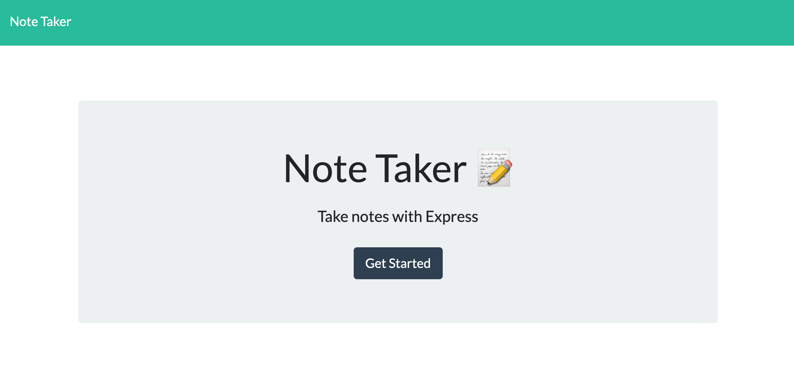
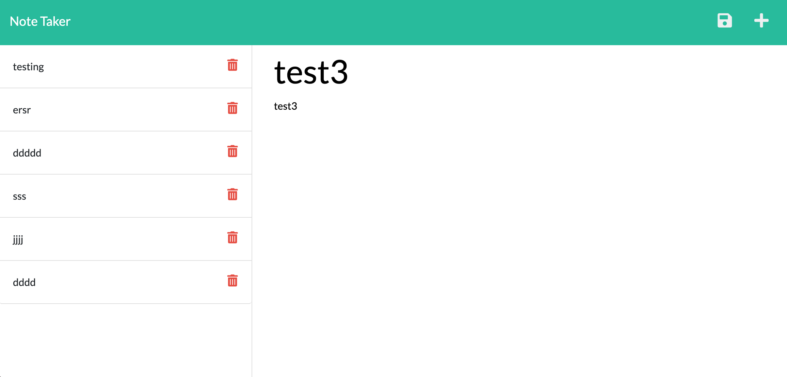
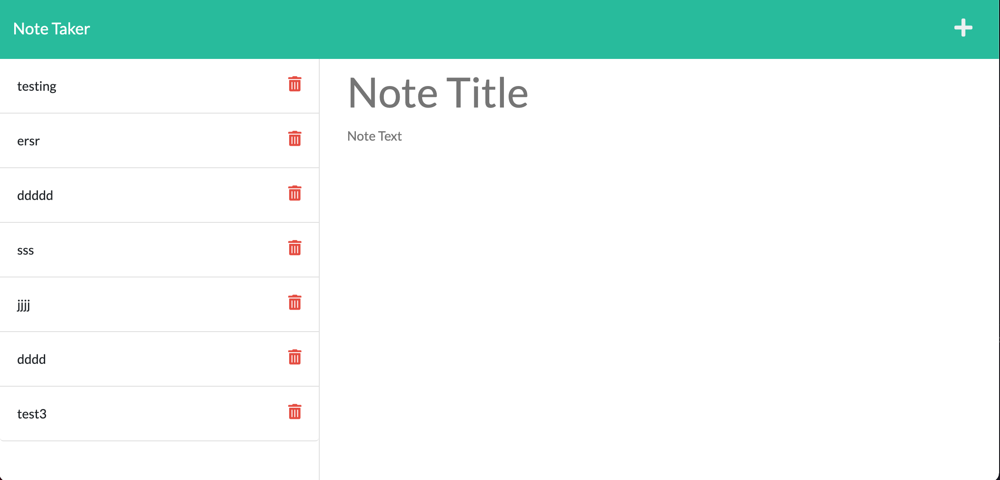

# Note-Taker

## Description
```
GIVEN a note-taking application
WHEN I open the Note Taker
THEN I am presented with a landing page with a link to a notes page
WHEN I click on the link to the notes page
THEN I am presented with a page with existing notes listed in the left-hand column, plus empty fields to enter a new note title and the note’s text in the right-hand column
WHEN I enter a new note title and the note’s text
THEN a Save icon appears in the navigation at the top of the page
WHEN I click on the Save icon
THEN the new note I have entered is saved and appears in the left-hand column with the other existing notes
WHEN I click on an existing note in the list in the left-hand column
THEN that note appears in the right-hand column
WHEN I click on the Write icon in the navigation at the top of the page
THEN I am presented with empty fields to enter a new note title and the note’s text in the right-hand column
```

## Installation
1. clone repository
2. npm install express and uuid

## Usage
Users would be able to type in notes and save the notes onto the left hand side. I just haven't been able to solve the issue of clicking on existing notes to appear on the right and to delete notes.







## Deployed Site
[Heroku](https://gia-note-taker.herokuapp.com)

[Github](https://github.com/gt1222/Note-Taker)
